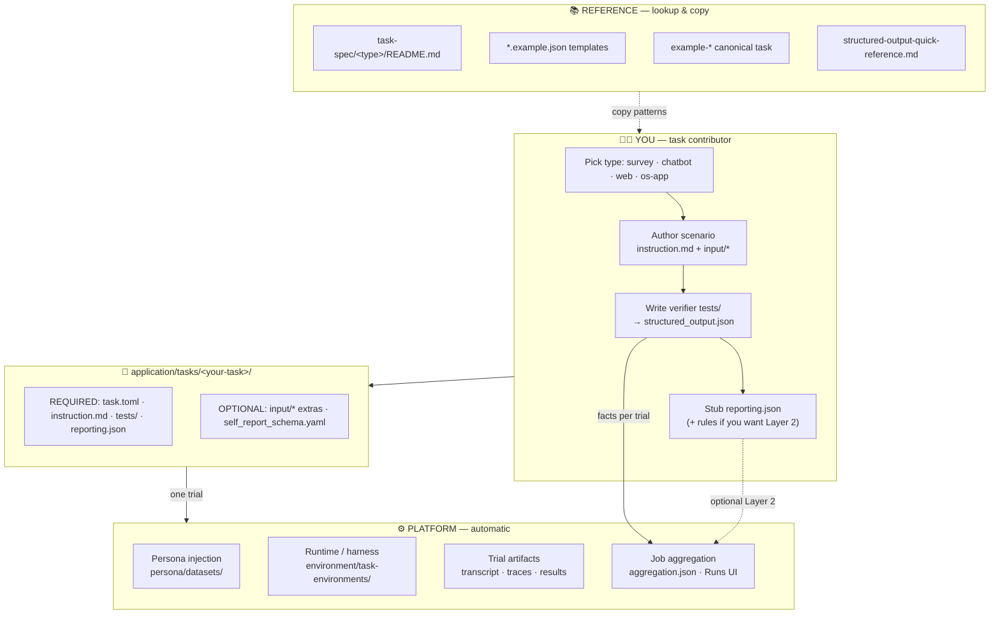
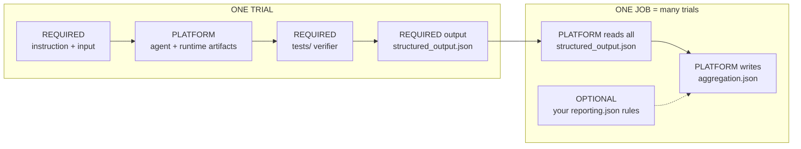
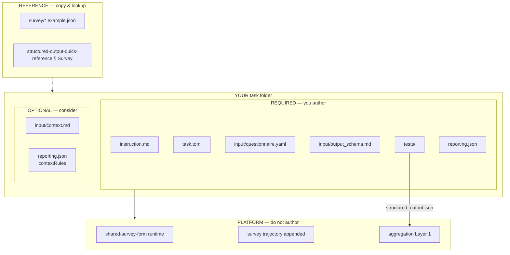
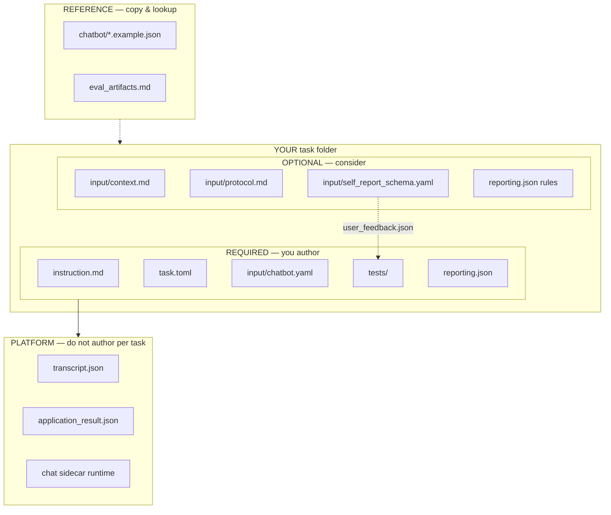
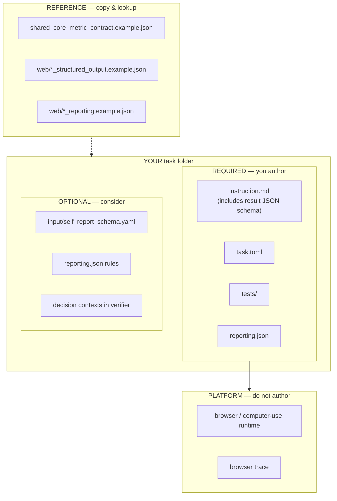
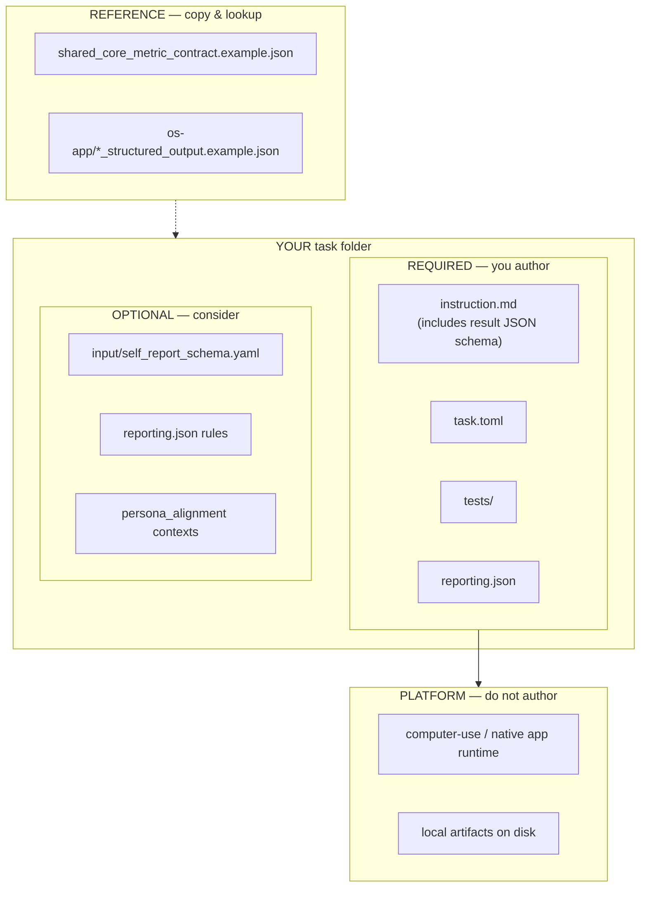
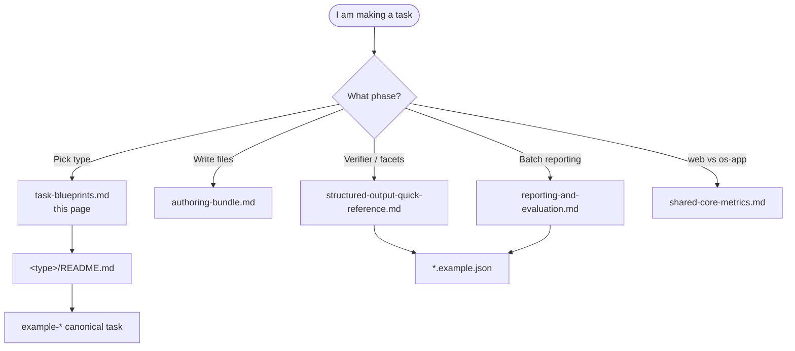

# Task blueprints — visual maps

Use this page when the prose specs feel dense. It answers one question:

> **What must I author, what can I add later, and what is platform-owned or
> reference-only?**

Legend used in every diagram:

| Label | Meaning | Your action |
|---|---|---|
| **REQUIRED** | Ship without this and the task is incomplete | **You write it** in your task folder |
| **OPTIONAL** | Improves debrief quality or scenario richness | **You add when the study needs it** |
| **PLATFORM** | Runtime, harness, or job rollup | **Do not author** — know it exists |
| **REFERENCE** | Contracts, examples, canonical tasks | **Copy and lookup** — do not reinvent |

---

## Ecosystem — the whole spec at a glance



**Read the arrows:**

1. **You** pick a type and fill the task folder.
2. **Platform** runs personas, collects harness artifacts, rolls up jobs.
3. **Reference** docs tell you *which* facet keys and file shapes to copy — they
   are not files you commit per task.

---

## One trial → one job (responsibility split)



| Output | Who writes | Required? |
|---|---|---|
| `instruction.md`, `input/*` | You | Yes |
| Harness artifacts (transcript, traces, …) | Platform | — |
| `verifier/structured_output.json` | You (verifier) | Yes |
| `reporting.json` empty stub | You | Yes (stub is enough) |
| `reporting.json` LLM rules | You | Optional |
| `aggregation.json` | Platform | — |

---

## Survey blueprint

**Canonical copy-from:** `application/tasks/example-survey_product-feedback`  
**Contract:** [survey/README.md](survey/README.md)



| Verifier must emit | Priority |
|---|---|
| `question_response` per question | **Required** |
| `trial_summary` | **Required** |
| Layer 2 summarize `reason` by `response` | Optional in `reporting.json` |

---

## Chatbot blueprint

**Canonical copy-from:** `application/tasks/recommender-agent_chat_api`  
**Contract:** [chatbot/README.md](chatbot/README.md) · harness: [chatbot/eval_artifacts.md](chatbot/eval_artifacts.md)



| Verifier context | Priority |
|---|---|
| `task_outcome` | **Required** |
| `conversation_summary` | Strongly recommended |
| `user_feedback` | Recommended when `self_report_schema.yaml` exists |
| `policy_and_trust`, `coordination` | Optional depth |

**Do not** create per-task `output_schema.md` for chatbot — platform owns the
harness artifacts listed in `eval_artifacts.md`.

---

## Web blueprint

**Canonical copy-from:** `application/tasks/example-web-playwright_quote-choice`  
**Contract:** [web/README.md](web/README.md) · shared core: [shared-core-metrics.md](shared-core-metrics.md)



Web tasks use **two verifier layers**:

1. **Shared core** (`task_outcome`, `side_effects`, `user_feedback`, …) — same
   keys as os-app → [shared-core-metrics.md](shared-core-metrics.md)
2. **Web layer** (`decision`, `decision_process`, `web_interaction`, …) — for
   browse/choose scenarios

| Context | Priority |
|---|---|
| `task_outcome` | **Required** |
| `decision` + `decision_process` | **Required** for browse/choose tasks |
| `goal_component`, `side_effects`, `user_feedback` | Strongly recommended |
| `web_interaction`, `experience` | Optional depth |

**No** `input/output_schema.md` — put the submission JSON schema inline in
`instruction.md`.

---

## OS / app blueprint

**Canonical copy-from:** `application/tasks/example-computer-use-ios_photo-access-review`  
**Contract:** [os-app/README.md](os-app/README.md) · shared core: [shared-core-metrics.md](shared-core-metrics.md)



OS/app emphasizes **outcome-based verification** (final state, not action
sequence). Reuse the **same shared core** as web; add scenario-specific contexts
(local artifact checks, cross-app handoff) on top — do not rename shared facet
keys.

| Context | Priority |
|---|---|
| `task_outcome` | **Required** |
| `goal_component`, `side_effects` | Strongly recommended |
| `user_feedback`, `persona_alignment` | When the study needs them |
| `infeasibility` | When tasks can be intentionally blocked |

---

## Which doc when? (navigation map)



| I need to… | Open |
|---|---|
| See the big picture & required vs optional | **This page** |
| Onboard step-by-step | [README.md](README.md) |
| File tree for my type | [authoring-bundle.md](authoring-bundle.md) |
| Context/facet cheat sheet | [structured-output-quick-reference.md](structured-output-quick-reference.md) |
| How aggregation works | [reporting-and-evaluation.md](reporting-and-evaluation.md) |
| Copy-paste commands | [../tasks/README.md](../tasks/README.md) |

---

## Minimum viable task (all types)

Every type ships this skeleton — everything else is optional or reference:

```text
application/tasks/<your-task>/
├── task.toml              REQUIRED
├── instruction.md         REQUIRED
├── tests/                 REQUIRED → structured_output.json
├── reporting.json         REQUIRED (empty contextRules OK)
└── input/                 type-specific REQUIRED files inside
```

If you only do the **REQUIRED** column in your type blueprint above, the task
runs and Layer 1 batch stats appear in Runs. Add **OPTIONAL** pieces when the
product question needs richer debrief or persona self-report.
