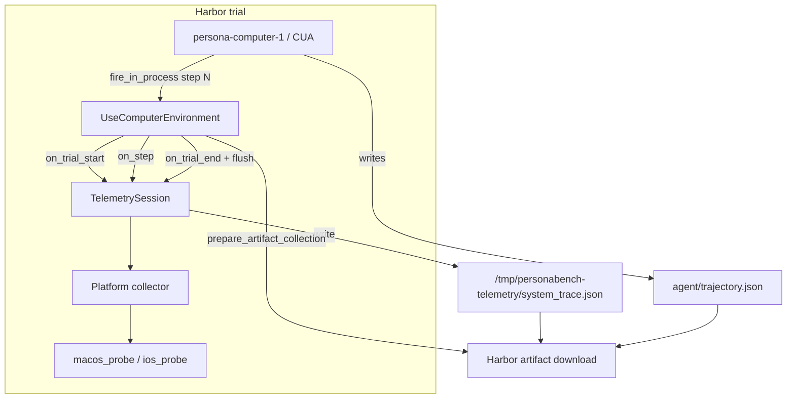

# Computer-use system telemetry — design & implementation

> **Audience:** Environment team engineers, reviewers.  
> **Demo walkthrough:** [computer-use-telemetry-demo.md](./computer-use-telemetry-demo.md).  
> **Operator reference:** [computer-use-telemetry.md](./computer-use-telemetry.md).

This document explains **what we added** to MatrAIx for `use-computer` trials, **how it is designed**, and **why** key decisions were made.

---

## Problem statement

Computer-use agents (CUA) operate from screenshots and tool actions. For notification-preference tasks (and similar), we need:

1. A **full agent trace** — prompts, steps, screenshots, structured output (`decision.json`).
2. **System-side ground truth** — what the OS actually reports for notification settings, independent of what the agent perceived.

Without (2), evaluation and downstream reports can only trust the agent’s self-report — which our demos show can diverge from plist/simulator state.

---

## Design principles

| Principle | Choice |
|-----------|--------|
| **Ownership** | Telemetry lives in the **environment** (`UseComputerEnvironment`), not in persona agents. Any agent on `use-computer` gets traces automatically. |
| **Opt-out, not opt-in** | `telemetry_enabled: true` by default for macOS and iOS. |
| **Same trial, two traces** | Agent trajectory (`agent/trajectory.json`) and system trace (`system_trace.json`) are separate artifacts, linked in `links`. |
| **Snapshot model** | `baseline` → `step` (per CUA step) → `final` so you can diff state over time. |
| **Probe on the right host** | macOS probe runs **inside** the remote Mac sandbox; iOS probe runs on the **Mac host** that owns the booted Simulator. |
| **Task declares artifacts** | Tasks list `/tmp/personabench-telemetry` in `task.toml` so Harbor collects it after the trial. |

---

## Architecture



### Lifecycle hooks (`use_computer.py`)

| Event | Telemetry action |
|-------|------------------|
| `start()` / trial begin | `TelemetrySession.on_trial_start` → `baseline` snapshot |
| `fire_in_process` (each CUA step) | `on_step` → `step` snapshot with `signals.step` |
| Trial end / teardown | `on_trial_end` → `final` snapshot; `link_host_trajectory` if available |
| `prepare_artifact_collection()` | `flush` writes `system_trace.json` while sandbox is still up |

---

## Module layout

| Module | Responsibility |
|--------|----------------|
| `personabench/telemetry/session.py` | Orchestrates lifecycle, builds `TelemetryTrace`, flush, trajectory linking |
| `personabench/telemetry/schema.py` | `TelemetryTrace`, `Snapshot`, `SessionInfo`; `schema_version: 1.0` |
| `personabench/telemetry/factory.py` | `get_collector(platform)` → macOS or iOS collector |
| `personabench/telemetry/paths.py` | `TELEMETRY_ROOT`, `SYSTEM_TRACE_PATH` |
| `personabench/telemetry/collector.py` | Shared collector interface |
| `personabench/telemetry/macos_collector.py` | Wraps macOS probe via `environment.exec` |
| `personabench/telemetry/macos_probe.py` | Reads Focus/DND + `ncprefs` on remote Mac |
| `personabench/telemetry/ios_collector.py` | Wraps iOS probe on simulator host |
| `personabench/telemetry/ios_probe.py` | `simctl`, BulletinBoard plists, TCC fallback |
| `personabench/telemetry/nskeyedarchiver.py` | Parses nested NSKeyedArchiver blobs in iOS plists |
| `harbor/environments/use_computer.py` | Wires `TelemetrySession` into trial lifecycle |

---

## Trace schema (summary)

Single file: `system_trace.json`

```json
{
  "schema_version": "1.0",
  "platform": "macos | ios",
  "session": { "trial_id", "task", "started_at", "ended_at", "duration_sec" },
  "snapshots": [
    { "ts", "phase": "baseline | step | final", "signals": { ... } }
  ],
  "artifacts": { "system_trace_path", "telemetry_root" },
  "links": {
    "agent_trajectory_path": "agent/trajectory.json",
    "agent_session_id",
    "agent_step_count",
    "agent_recording_path"
  }
}
```

`signals` shape is platform-specific but always includes a `notifications` block with `watched_apps` for task-relevant bundles.

---

## Platform probes

### macOS

Runs on the **remote Mac** via `environment.exec`:

| Signal source | What we read |
|---------------|--------------|
| `com.apple.ncprefs.plist` | Per-app notification flags → `watched_apps[bundle].notifications_enabled` |
| Do Not Disturb DB | Focus / assertion state |
| `defaults` | Legacy DND host flag |
| Process list | `usernoted`, `NotificationCenter` presence |

**Watched bundles** include `com.apple.mail`, `com.apple.MobileSMS`, `com.apple.Safari`, etc., aligned with the notification-preferences tasks.

### iOS Simulator

Runs on the **Mac host** that runs `simctl` (not inside the simulated device):

| Signal source | What we read |
|---------------|--------------|
| `simctl list devices -j` | Booted simulator metadata; honors `device_type` / `runtime` hints from `task.toml` |
| `VersionedSectionInfo.plist` | Per-bundle NSKeyedArchiver sections → `authorization_status`, `notifications_enabled` |
| `SectionInfo.plist` | Legacy flat bundle map (fallback) |
| `TCC.db` | Notification authorization rows **only** when BulletinBoard data is missing |

#### iOS parsing challenge (VersionedSectionInfo)

`VersionedSectionInfo.plist` is **not** a single top-level NSKeyedArchiver blob. Structure:

```
{
  sectionInfo: { "<bundle_id>": <nested NSKA bytes>, ... },
  sectionInfoVersionNumber: 2
}
```

We added `nskeyedarchiver.py` to walk nested archives and extract `BBSectionInfoSettings.authorizationStatus`. This became the **primary** ground-truth source for Messages (`com.apple.MobileSMS`) in demo trials.

#### Simulator resolution

Hints in `task.toml` are normalized (`iPhone-17` ↔ `iPhone 17`, runtime tokens). If no hint matches a booted device, probe falls back to any booted simulator and records `simulator_meta.hint_fallback: true`.

#### Paths on use.computer

Sandbox home may be `/Users/macrack/...` rather than the developer laptop. Data roots are resolved via `simctl get_app_container` and simulator library paths on the host — not `Path.home()` on the wrong machine.

---

## Integration with Harbor

### Task configuration

Tasks must declare the telemetry directory for artifact collection:

```toml
artifacts = ["/tmp/personabench-telemetry"]
```

Agent decision paths remain separate, e.g. `/tmp/personabench-macos-notification-preferences`.

### Environment configuration

```yaml
environment:
  type: use-computer
  kwargs:
    telemetry_enabled: true   # default
    reservation_id: ${USE_COMPUTER_RESERVATION_ID}
```

### Persona agent (`persona-computer-1`)

The persona agent is **unchanged** by telemetry. It:

- Injects persona YAML into the system prompt
- Runs the CUA loop (screenshots, actions)
- Writes `decision.json` to the task’s output path

Telemetry observes the same trial from the environment side.

---

## Demo matrix (what we added for presentation)

| Asset | Purpose |
|-------|---------|
| `configs/jobs/example-job-recipe/appSim-demo-cu-macos-p0042.yaml` | macOS + persona 0042 |
| `configs/jobs/example-job-recipe/appSim-demo-cu-macos-p1206.yaml` | macOS + persona 1206 |
| `configs/jobs/example-job-recipe/appSim-demo-cu-ios-p0042.yaml` | iOS + persona 0042 |
| `configs/jobs/example-job-recipe/appSim-demo-cu-ios-p1206.yaml` | iOS + persona 1206 |
| `scripts/demo-cu-persona-matrix.sh` | Run all four sequentially |
| `computer-use-telemetry-demo.md` | Live demo script + screenshots |
| `computer-use-telemetry.md` | Operator / schema reference |

---

## Harbor viewer fixes (supporting the demo)

To inspect trajectories and screenshots in the browser:

| Change | File | Why |
|--------|------|-----|
| npm fallback when bun missing | `harbor/cli/view.py` | Build viewer without bun |
| Job vs trial folder detection | `harbor/viewer/scanner.py` | `harbor view jobs/<single-job>` works |
| Trial slug → parent job | `scanner.py`, `server.py`, `apps/viewer/.../job.tsx` | Deep links to trials resolve correctly |
| Unit tests | `tests/unit/viewer/test_job_scanner.py` | Regression coverage |

System telemetry is **not** rendered in the viewer UI yet — inspect via `system_trace.json` or `jq` (see demo doc).

---

## Testing

| Layer | Coverage |
|-------|----------|
| NSKeyedArchiver parser | Unit tests on fixture plist bytes |
| iOS / macOS probe helpers | Unit tests where pure functions exist |
| End-to-end | Oracle harbor runs (no LLM) + persona demo jobs |
| Viewer scanner | `test_job_scanner.py` |

---

## Known limitations & follow-ups

| Item | Status |
|------|--------|
| Viewer tab for `system_trace.json` | Not implemented — JSON on disk only |
| iOS `simctl privacy status` | Does not exist on current Xcode; we use BulletinBoard plists |
| TCC vs BulletinBoard | TCC only fills gaps; BulletinBoard is authoritative when present |
| Older demo trials | Re-run if probe code changed (e.g. iOS p1206 before `versioned_section_info` fix) |
| Focus/DND signals | Collected on macOS; not yet central to notification demo narrative |
| Linux / Windows | Out of scope for this telemetry pass |

---

## How this maps to Environment team goals (Task 1 / Task 5)

From [PLAN.md](./PLAN.md):

- **Task 1 (shared telemetry):** `system_trace.json` is an environment-emitted trace alongside the agent trajectory, with a stable schema and lifecycle hooks.
- **Task 5 (app/sandbox):** `use-computer` macOS + iOS is the first app-surface environment with **system-side** signals, not just UI automation logs.

---

## Related

- [computer-use-telemetry-demo.md](./computer-use-telemetry-demo.md) — presentation walkthrough
- [computer-use-telemetry.md](./computer-use-telemetry.md) — schema, enable/disable, smoke commands
- [docs/running.md](./docs/running.md) — agent and API setup
