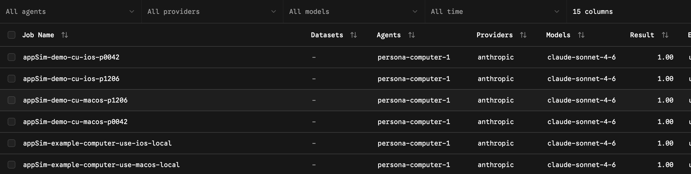
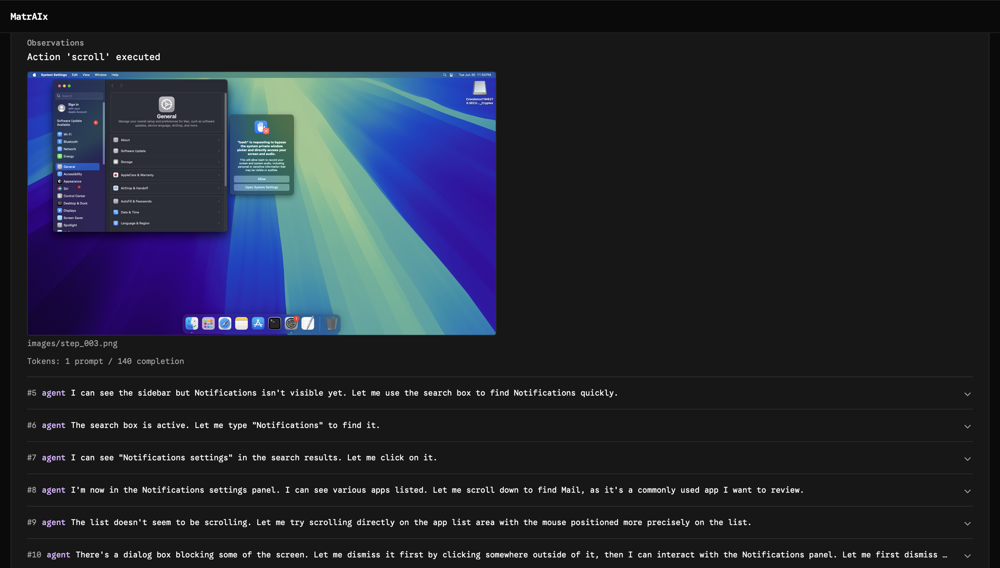

# Computer-use telemetry — walkthrough

> **Companion:** [computer-use-telemetry-design.md](./computer-use-telemetry-design.md) · [computer-use-telemetry.md](./computer-use-telemetry.md)

This document walks through the notification-preferences computer-use tasks on **macOS** and **iOS Simulator**. Each trial produces an agent trajectory and a system telemetry trace (`system_trace.json`) that can be compared for evaluation and reporting.

---

## Overview

| Output | Description | Location |
|--------|-------------|----------|
| Agent trajectory | Persona-injected prompts, tool calls, per-step screenshots | `agent/trajectory.json`, `agent/images/` |
| Structured decision | Agent’s notification preference judgment | `artifacts/tmp/personabench-*-notification-preferences/decision.json` |
| System telemetry | OS-reported notification state | `artifacts/tmp/personabench-telemetry/system_trace.json` |

System telemetry is collected by the environment (`UseComputerEnvironment`), not by the persona agent. See [computer-use-telemetry-design.md](./computer-use-telemetry-design.md) for architecture.

---

## Prerequisites

```bash
export USE_COMPUTER_API_KEY=...
export USE_COMPUTER_RESERVATION_ID=...
export ANTHROPIC_API_KEY=...

uv sync --extra use-computer --extra computer-1
```

---

## Example job configurations

Persona demo jobs (two personas × macOS + iOS):

| Job | Persona | Platform | Example trial |
|-----|---------|----------|---------------|
| `appSim-demo-cu-macos-p0042` | `persona_0042` | macOS | `example-computer-use-macos_notif__y6wPBEf` |
| `appSim-demo-cu-macos-p1206` | `persona_1206` | macOS | `example-computer-use-macos_notif__eKhq6jt` |
| `appSim-demo-cu-ios-p0042` | `persona_0042` | iOS | `example-computer-use-ios_notific__JBFKrsW` |
| `appSim-demo-cu-ios-p1206` | `persona_1206` | iOS | `example-computer-use-ios_notific__5navd89` |

Run all four:

```bash
./scripts/demo-cu-persona-matrix.sh
```

Single job:

```bash
uv run harbor run -c configs/jobs/example-job-recipe/appSim-demo-cu-macos-p0042.yaml
```

Oracle validation (no LLM; probe and artifact path only):

```bash
uv run harbor run \
  -p application/tasks/example-computer-use-macos_notification-preferences \
  -a oracle -e use-computer

uv run harbor run \
  -p application/tasks/example-computer-use-ios_notification-preferences \
  -a oracle -e use-computer --ek platform=ios
```

---

## Inspecting trials in Harbor viewer

```bash
harbor view jobs                              # all jobs under jobs/
harbor view jobs/appSim-demo-cu-macos-p0042   # single job
```

Open a trial to access the **Trajectory**, **Artifacts**, and other tabs.

### Job list



---

## macOS

**Reference trial:** `jobs/appSim-demo-cu-macos-p0042/example-computer-use-macos_notif__y6wPBEf/`

The agent navigates **System Settings → Notifications**, reviews **Mail**, and writes `decision.json`.

### Trajectory

In the **Trajectory** tab, expand an agent step. Each step includes the agent message, tool calls, and an observation screenshot. For `persona-computer-1`, narrative text is in `step.message` (not a separate reasoning panel).



### Structured decision

Path: `artifacts/tmp/personabench-macos-notification-preferences/decision.json`

Example (persona 1206, `appSim-demo-cu-macos-p1206`):

```json
{
  "keep_notifications_on": true,
  "app_reviewed": "FaceTime",
  "reason": "I reviewed FaceTime notification settings — banners style enabled, sound on, badge on. As someone working remotely with caregiving responsibilities, missing a FaceTime call is not acceptable risk. Notifications must stay on."
}
```

### System telemetry and comparison

Path: `artifacts/tmp/personabench-telemetry/system_trace.json`

Compare agent-reported UI state with OS ground truth:

```bash
jq .reason \
  jobs/appSim-demo-cu-macos-p0042/example-computer-use-macos_notif__y6wPBEf/artifacts/tmp/personabench-macos-notification-preferences/decision.json

jq '.snapshots[-1].signals.notifications.watched_apps["com.apple.mail"]' \
  jobs/appSim-demo-cu-macos-p0042/example-computer-use-macos_notif__y6wPBEf/artifacts/tmp/personabench-telemetry/system_trace.json
```

Example output (persona 0042, Mail):

| Source | Observation |
|--------|-------------|
| Agent (`decision.json`) | Master **Allow Notifications** toggle reported as disabled in System Settings |
| Telemetry (`ncprefs`) | `"notifications_enabled": true` for `com.apple.mail` |

```text
$ jq .reason …/decision.json
"…the master Allow Notifications toggle is presently disabled…"

$ jq '…watched_apps["com.apple.mail"]' …/system_trace.json
{ "notifications_enabled": true, "flags": 276824078 }
```

This divergence illustrates why system-side telemetry is recorded independently of the agent trajectory.

---

## iOS

**Reference trial:** `jobs/appSim-demo-cu-ios-p0042/example-computer-use-ios_notific__JBFKrsW/`

The agent reviews **Messages** notification settings in the Simulator and writes `decision.json`.

### Trajectory


### Structured decision

Path: `artifacts/tmp/personabench-ios-notification-preferences/decision.json`

Example (persona 1206, `appSim-demo-cu-ios-p1206`):

```json
{
  "keep_notifications_on": true,
  "app_reviewed": "Messages",
  "reason": "Messages is daily-use critical communication app. Caregiving responsibilities require immediate awareness of incoming messages from family members. Missing such messages is not acceptable risk. Notifications must remain enabled so important contacts can reach me without delay."
}
```

### System telemetry

```bash
jq '.snapshots[-1].signals.notifications.watched_apps["com.apple.MobileSMS"]' \
  jobs/appSim-demo-cu-ios-p0042/example-computer-use-ios_notific__JBFKrsW/artifacts/tmp/personabench-telemetry/system_trace.json
```

Example output:

```json
{
  "source": "versioned_section_info",
  "display_name": "Messages",
  "authorization_status": 2,
  "notifications_enabled": true
}
```

Ground truth is parsed from `VersionedSectionInfo.plist` on the simulator host (see [computer-use-telemetry.md](./computer-use-telemetry.md)).

---

## Persona variation

The same task with different personas (`p0042` vs `p1206`) yields different `decision.json` narratives while `system_trace.json` reflects the same OS state when simulator settings are unchanged.

---

## Trial artifact layout

```
jobs/<job>/<trial>/
├── agent/
│   ├── trajectory.json
│   ├── images/step_*.png
│   └── recording.mp4
├── artifacts/
│   ├── tmp/matraix-telemetry/system_trace.json
│   └── tmp/personabench-*-notification-preferences/decision.json
├── result.json
└── verifier/reward.txt
```

---

## Related

- [computer-use-telemetry-design.md](./computer-use-telemetry-design.md)
- [computer-use-telemetry.md](./computer-use-telemetry.md)
- [docs/running.md](./docs/running.md)
