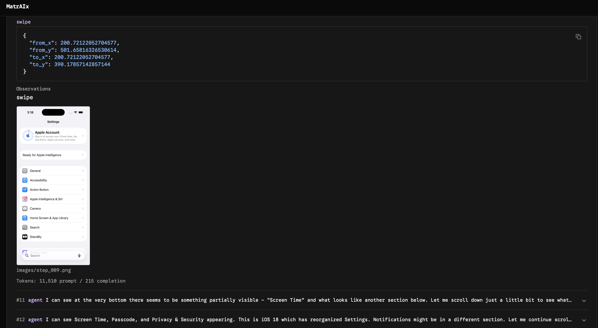

# Computer-use telemetry — demo walkthrough

> **Audience:** Environment team, stakeholders, live demo.  
> **Companion doc:** [computer-use-telemetry-design.md](./computer-use-telemetry-design.md) (what we built and why).  
> **Reference:** [computer-use-telemetry.md](./computer-use-telemetry.md) (schema, probes, smoke jobs).

This walkthrough shows a **persona-conditioned computer-use agent** on **macOS** and **iOS Simulator**, with **system-side ground truth** collected alongside the agent trajectory. The punchline: the agent’s narrative and structured decision can disagree with what the OS actually reports.

### Demo assets (3 images + 3 text proofs)

| # | Type | Asset | Status |
|---|------|-------|--------|
| 1 | Image | Job list — `images/demo/01-harbor-job-list.png` | ✓ |
| 2 | Image | macOS trajectory — `images/demo/02-harbor-macos-trial.png` | ✓ |
| 3 | Image | iOS trajectory — `images/demo/03-harbor-ios-trial.png` | ✓ |
| 4 | Text | macOS `decision.json` (persona 1206, FaceTime) — §2b below | ✓ |
| 5 | Text | iOS `decision.json` (persona 1206, Messages) — §3b below | ✓ |
| 6 | Text | Agent vs OS compare — terminal `jq` (macOS p0042 Mail) — §2c below | ✓ |

---

## What you are showing

| Layer | What it is | Where to look |
|-------|------------|---------------|
| **Persona agent** | `persona-computer-1` — Claude with persona injected in the system prompt | `agent/trajectory.json`, Harbor viewer |
| **Task** | Review notification settings for Mail (macOS) or Messages (iOS); write `decision.json` | Task instruction + verifier |
| **Agent perception** | Per-step screenshots + reasoning in trajectory | Harbor viewer, `agent/images/step_*.png` |
| **System ground truth** | OS notification state from plist / BulletinBoard | `artifacts/tmp/matraix-telemetry/system_trace.json` |

---

## Prerequisites

```bash
export USE_COMPUTER_API_KEY=...
export USE_COMPUTER_RESERVATION_ID=...
export ANTHROPIC_API_KEY=...

uv sync --extra use-computer --extra computer-1
```

---

## Recorded demo runs (ready to view)

Four jobs were run with two personas × two platforms. Each job writes to its own `jobs/<job_name>/` tree.

| Job | Persona | Platform | Trial slug |
|-----|---------|----------|------------|
| `appSim-demo-cu-macos-p0042` | `persona_0042` | macOS | `example-computer-use-macos_notif__y6wPBEf` |
| `appSim-demo-cu-macos-p1206` | `persona_1206` | macOS | `example-computer-use-macos_notif__eKhq6jt` |
| `appSim-demo-cu-ios-p0042` | `persona_0042` | iOS | `example-computer-use-ios_notific__JBFKrsW` |
| `appSim-demo-cu-ios-p1206` | `persona_1206` | iOS | `example-computer-use-ios_notific__5navd89` |

All four trials completed with **reward 1.0**.

---

## Part 1 — Open the Harbor viewer

```bash
# All four jobs
harbor view jobs

# Or one platform at a time
harbor view jobs/appSim-demo-cu-macos-p0042
harbor view jobs/appSim-demo-cu-ios-p0042
```

Browser URLs:

- macOS p0042: `http://127.0.0.1:8080/jobs/appSim-demo-cu-macos-p0042`
- iOS p0042: `http://127.0.0.1:8080/jobs/appSim-demo-cu-ios-p0042`

Click the trial row to open trajectory, screenshots, agent logs, and artifacts.

### Screenshot: job list

<!-- TODO: replace path when screenshot is added -->


---

## Part 2 — macOS demo (persona 0042)

**Trial:** `jobs/appSim-demo-cu-macos-p0042/example-computer-use-macos_notif__y6wPBEf/`

### 2a. Agent trajectory and screenshots

The agent opens **System Settings → Notifications**, reviews **Mail**, and writes a persona-grounded decision.

In the **Trajectory** tab, expand an **agent** step (e.g. step 1 or the final step). You get:

1. **Message** — persona narrative / plan (this *is* the reasoning; there is no separate panel)
2. **Tool calls** — computer actions
3. **Observation** — screenshot for that step (inline below the text)

> For `persona-computer-1`, reasoning is in `step.message`, not a dedicated “Reasoning” block. That block only appears for models that emit `reasoning_content` (extended thinking).

### Screenshot: macOS trial view

Capture one expanded agent step so both the text and screenshot are visible:


### 2b. Structured decision

**Path:** `artifacts/tmp/matraix-macos-notification-preferences/decision.json`

Example fields:

- `keep_notifications_on` — agent’s choice
- `app_reviewed` — `"Mail"`
- `reason` — persona-style justification

### macOS `decision.json` (persona 1206 — text capture)

Trial: `appSim-demo-cu-macos-p1206` / `eKhq6jt`  
Path: `artifacts/tmp/matraix-macos-notification-preferences/decision.json`

```json
{
  "keep_notifications_on": true,
  "app_reviewed": "FaceTime",
  "reason": "I reviewed FaceTime notification settings — banners style enabled, sound on, badge on. As someone working remotely with caregiving responsibilities, missing a FaceTime call is not acceptable risk. Notifications must stay on."
}
```

### 2c. System ground truth + agent comparison (#6 in screenshot list)

**Path:** `artifacts/tmp/matraix-telemetry/system_trace.json`

This is the **optional compare slide** — no Harbor tab for it yet; use the terminal (or open the JSON file in your editor).

**macOS example (persona 0042, Mail — best “perception vs OS” story):**

```bash
# Agent decision (what the persona concluded)
jq .reason \
  jobs/appSim-demo-cu-macos-p0042/example-computer-use-macos_notif__y6wPBEf/artifacts/tmp/matraix-macos-notification-preferences/decision.json

# OS ground truth (what ncprefs reports)
jq '.snapshots[-1].signals.notifications.watched_apps["com.apple.mail"]' \
  jobs/appSim-demo-cu-macos-p0042/example-computer-use-macos_notif__y6wPBEf/artifacts/tmp/matraix-telemetry/system_trace.json
```

**Text capture for demo doc (macOS p0042 — terminal compare):**

```text
$ jq .reason jobs/.../decision.json
"Having examined Mail's notification configuration in System Settings, I observe that the
 master Allow Notifications toggle is presently disabled, while the subsidiary settings …
 Therefore, I would keep notifications on for Mail."

$ jq '.snapshots[-1].signals.notifications.watched_apps["com.apple.mail"]' jobs/.../system_trace.json
{
  "app_name": null,
  "flags": 276824078,
  "notifications_enabled": true
}
```

| Source | Key fact |
|--------|----------|
| Agent (`decision.json`) | Master Allow Notifications toggle is **disabled** (per UI) |
| Telemetry (`watched_apps`) | `"notifications_enabled": true` from `ncprefs` |

That mismatch is the demo punchline — screenshots optional; two `jq` outputs side-by-side in a terminal is enough.

**iOS example (persona 0042, Messages):**

```bash
jq .reason \
  jobs/appSim-demo-cu-ios-p0042/example-computer-use-ios_notific__JBFKrsW/artifacts/tmp/matraix-ios-notification-preferences/decision.json

jq '.snapshots[-1].signals.notifications.watched_apps["com.apple.MobileSMS"]' \
  jobs/appSim-demo-cu-ios-p0042/example-computer-use-ios_notific__JBFKrsW/artifacts/tmp/matraix-telemetry/system_trace.json
```

**Text capture (iOS p0042 telemetry):**

```json
{
  "source": "versioned_section_info",
  "display_name": "Messages",
  "authorization_status": 2,
  "notifications_enabled": true
}
```

Agent and telemetry **agree** on iOS p0042 (keep on + enabled). macOS p0042 is the stronger contrast slide.

---

## Part 3 — iOS demo (persona 0042)

**Trial:** `jobs/appSim-demo-cu-ios-p0042/example-computer-use-ios_notific__JBFKrsW/`

Same pattern: persona reviews **Messages** notification settings in the Simulator, writes `decision.json`, verifier checks the file.

### 3a. Trajectory and screenshots

Same as macOS: **Trajectory** tab → expand an agent step → message + screenshot together.

### Screenshot: iOS trial view



### 3b. Structured decision

**Path:** `artifacts/tmp/matraix-ios-notification-preferences/decision.json`

### iOS `decision.json` (persona 1206 — text capture)

Trial: `appSim-demo-cu-ios-p1206` / `5navd89`  
Path: `artifacts/tmp/matraix-ios-notification-preferences/decision.json`

```json
{
  "keep_notifications_on": true,
  "app_reviewed": "Messages",
  "reason": "Messages is daily-use critical communication app. Caregiving responsibilities require immediate awareness of incoming messages from family members. Missing such messages is not acceptable risk. Notifications must remain enabled so important contacts can reach me without delay."
}
```

### 3c. System ground truth (iOS)

```bash
jq '.snapshots[-1].signals.notifications.watched_apps["com.apple.MobileSMS"]' \
  jobs/appSim-demo-cu-ios-p0042/example-computer-use-ios_notific__JBFKrsW/artifacts/tmp/matraix-telemetry/system_trace.json
```

On the latest probe, Messages shows `source: versioned_section_info` and `authorization_status: 2` (authorized) from `VersionedSectionInfo.plist` — not from UI alone.

---

## Part 4 — Two personas, same task

Open `appSim-demo-cu-macos-p1206` and `appSim-demo-cu-ios-p1206` and compare:

| Compare | macOS trials | iOS trials |
|---------|--------------|------------|
| Persona voice | `y6wPBEf` vs `eKhq6jt` | `JBFKrsW` vs `5navd89` |
| `decision.json` → `reason` | Different narrative, same schema | Same |
| `system_trace.json` | Same OS ground truth if settings unchanged | Same |

**Talking point:** Personas change *how* the agent reasons and decides; system telemetry gives a stable OS read regardless of persona.

---

## Part 5 — Re-run live (optional)

```bash
# All four jobs (~$3–6 Anthropic, pennies sandbox)
./scripts/demo-cu-persona-matrix.sh

# Platform filter
./scripts/demo-cu-persona-matrix.sh macos
./scripts/demo-cu-persona-matrix.sh ios

# Single job
uv run harbor run -c configs/jobs/example-job-recipe/appSim-demo-cu-macos-p0042.yaml
```

Oracle smoke (no LLM, validates probe + artifact path only):

```bash
uv run harbor run \
  -p application/tasks/example-computer-use-macos_notification-preferences \
  -a oracle -e use-computer

uv run harbor run \
  -p application/tasks/example-computer-use-ios_notification-preferences \
  -a oracle -e use-computer --ek platform=ios
```

---

## Demo script (5 minutes)

1. **Problem** — CUA agents only see pixels and their own reasoning; we need OS ground truth for evaluation and reports.
2. **Show macOS** — Harbor trajectory → Mail settings screenshots → `decision.json` → `jq` on `watched_apps`.
3. **Show iOS** — Same flow; call out Simulator + `VersionedSectionInfo` parsing.
4. **Persona contrast** — Flip to p1206; same task, different `reason`, telemetry unchanged.
5. **Close** — Telemetry is environment-owned, on by default, lands in `system_trace.json` next to `agent/trajectory.json`.

---

## Artifact map (one trial)

```
jobs/<job>/<trial>/
├── agent/
│   ├── trajectory.json      # persona prompts, tool calls, reasoning
│   ├── images/step_*.png    # per-step screenshots
│   └── recording.mp4        # screen recording (when enabled)
├── artifacts/
│   ├── tmp/matraix-telemetry/system_trace.json   # ← system ground truth
│   └── tmp/matraix-*-notification-preferences/decision.json
├── result.json
└── verifier/reward.txt
```

---

## Related

- [computer-use-telemetry-design.md](./computer-use-telemetry-design.md) — architecture and implementation
- [computer-use-telemetry.md](./computer-use-telemetry.md) — schema and probe details
- [choosing-an-agent.md](./choosing-an-agent.md) — `persona-computer-1` and API keys
