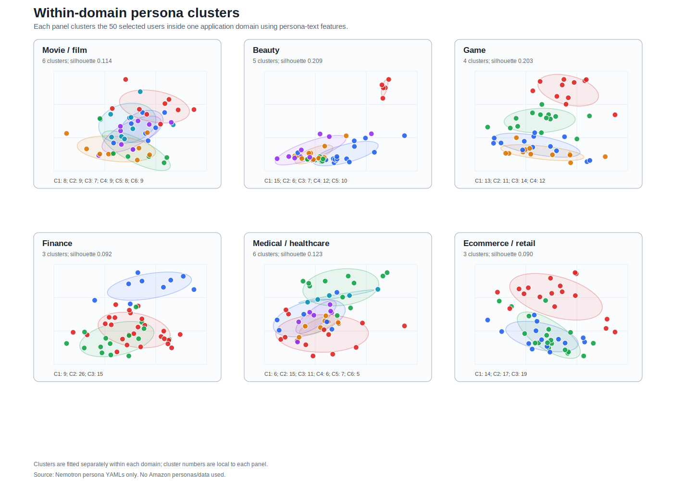

# Nemotron Within-Domain Cluster Visualization

This figure groups the 50 selected users inside each application domain into persona-text clusters. It is meant to show whether each domain test set contains multiple kinds of overall personas rather than one dense group.

## Method

- For each domain separately, build TF-IDF unigram/bigram features from the selected users’ full Nemotron persona text.
- Reduce the domain-specific feature matrix with truncated SVD.
- Select `k` between 3 and 6 using silhouette score with a small penalty for too many clusters.
- Fit KMeans clusters inside each domain.
- Plot one panel per domain; colors indicate clusters local to that domain.

Cluster numbers are not comparable across domains. For example, Cluster 1 in finance and Cluster 1 in beauty are unrelated labels.

## Cluster Summary

The table below describes clusters by common occupations and representative users. This avoids over-interpreting noisy automatic keyword labels from synthetic persona text.

| Domain | Cluster | Size | Common occupations | Representative user | Example users |
|---|---:|---:|---|---|---|
| Movie / film | 1 | 8 | television_video_or_film_camera_operator_or_editor, producer_or_director, entertainment_attendant_or_related_worker | Nemotron_33E2F5CD.yaml | Nemotron_0346F0E6.yaml; Nemotron_E6799456.yaml; Nemotron_57A28E83.yaml; Nemotron_D50EF2A3.yaml; Nemotron_9629F49C.yaml |
| Movie / film | 2 | 9 | actor, producer_or_director, news_analyst_reporter_or_journalist | Nemotron_1944D891.yaml | Nemotron_DC5AA468.yaml; Nemotron_19D95E15.yaml; Nemotron_6A6A08DC.yaml; Nemotron_1944D891.yaml; Nemotron_00CD8716.yaml |
| Movie / film | 3 | 7 | computer_support_specialist, photographer, project_management_specialist | Nemotron_A414C4A9.yaml | Nemotron_0D387DAA.yaml; Nemotron_61FA31AA.yaml; Nemotron_A414C4A9.yaml; Nemotron_ED5FAE08.yaml; Nemotron_59D510FC.yaml |
| Movie / film | 4 | 9 | broadcast_sound_or_lighting_technician, software_developer, coach_or_scout | Nemotron_6F8EDDD9.yaml | Nemotron_F4E81C14.yaml; Nemotron_2856A50C.yaml; Nemotron_F0730CE1.yaml; Nemotron_6F8EDDD9.yaml; Nemotron_2348BEB1.yaml |
| Movie / film | 5 | 8 | speech_language_pathologist, entertainer_or_performer_or_sports_worker, musician_or_singer | Nemotron_F6D7E39D.yaml | Nemotron_7D403154.yaml; Nemotron_81EE4579.yaml; Nemotron_07CE6779.yaml; Nemotron_8114965E.yaml; Nemotron_F6D7E39D.yaml |
| Movie / film | 6 | 9 | not_in_workforce, producer_or_director, photographic_process_worker_or_processing_machine_operator | Nemotron_E7B2C813.yaml | Nemotron_DCE8F389.yaml; Nemotron_9D5DF1B5.yaml; Nemotron_2BE10849.yaml; Nemotron_BB6ED2CF.yaml; Nemotron_C5DFFE4E.yaml |
| Beauty | 1 | 15 | hairdresser_hairstylist_or_cosmetologist, personal_appearance_worker, skincare_specialist | Nemotron_B9703EB5.yaml | Nemotron_B9703EB5.yaml; Nemotron_4DA88E6F.yaml; Nemotron_314682AC.yaml; Nemotron_C60AB24F.yaml; Nemotron_EC9DA548.yaml |
| Beauty | 2 | 6 | manicurist_or_pedicurist | Nemotron_B6BD82BB.yaml | Nemotron_B6BD82BB.yaml; Nemotron_F6736C89.yaml; Nemotron_F174C00B.yaml; Nemotron_F109DED6.yaml; Nemotron_29BC246C.yaml |
| Beauty | 3 | 7 | not_in_workforce, fashion_designer, personal_appearance_worker | Nemotron_EF4FC311.yaml | Nemotron_2CE5BEBC.yaml; Nemotron_EF4FC311.yaml; Nemotron_743E4506.yaml; Nemotron_E6118485.yaml; Nemotron_32D739C3.yaml |
| Beauty | 4 | 12 | barber, massage_therapist, acupuncturist | Nemotron_CEE8984B.yaml | Nemotron_F02E0666.yaml; Nemotron_B107ABF7.yaml; Nemotron_9DEC91B7.yaml; Nemotron_2AE05228.yaml; Nemotron_52FB1870.yaml |
| Beauty | 5 | 10 | personal_care_or_service_worker, personal_service_manager, software_developer | Nemotron_E45A72A7.yaml | Nemotron_6D759C33.yaml; Nemotron_607B7E76.yaml; Nemotron_6D574DD4.yaml; Nemotron_85B24790.yaml; Nemotron_3CD94D4C.yaml |
| Game | 1 | 13 | not_in_workforce, no_occupation | Nemotron_7839EDCD.yaml | Nemotron_713EDCBF.yaml; Nemotron_1473E563.yaml; Nemotron_7427AC68.yaml; Nemotron_36A000EC.yaml; Nemotron_7BD9AE09.yaml |
| Game | 2 | 11 | coin_vending_or_amusement_machine_servicer_or_repairer | Nemotron_080AE97F.yaml | Nemotron_30B017A3.yaml; Nemotron_F28427DA.yaml; Nemotron_C40FB0BD.yaml; Nemotron_B0EFB547.yaml; Nemotron_BC95D407.yaml |
| Game | 3 | 14 | gambling_services_worker, security_guard_or_gambling_surveillance_officer, gambling_cage_worker | Nemotron_7997C4ED.yaml | Nemotron_B93650F2.yaml; Nemotron_7997C4ED.yaml; Nemotron_EC4738D0.yaml; Nemotron_1BD8BE19.yaml; Nemotron_00024B04.yaml |
| Game | 4 | 12 | no_occupation, computer_occupation, not_in_workforce | Nemotron_93A40CC7.yaml | Nemotron_8A485D4A.yaml; Nemotron_528B6C30.yaml; Nemotron_31259C2D.yaml; Nemotron_9148C057.yaml; Nemotron_4E954075.yaml |
| Finance | 1 | 9 | tax_preparer, bookkeeping_accounting_or_auditing_clerk, budget_analyst | Nemotron_6D97E519.yaml | Nemotron_381C6F79.yaml; Nemotron_64A61EDB.yaml; Nemotron_1BE6B639.yaml; Nemotron_8ABF798C.yaml; Nemotron_2A2DC2F3.yaml |
| Finance | 2 | 26 | financial_manager, personal_financial_advisor, financial_or_investment_analyst | Nemotron_774AEC1B.yaml | Nemotron_AAC5CD6D.yaml; Nemotron_5793C2B8.yaml; Nemotron_5DC69A5F.yaml; Nemotron_B7F39A18.yaml; Nemotron_54EAE98D.yaml |
| Finance | 3 | 15 | accountant_or_auditor, bookkeeping_accounting_or_auditing_clerk, financial_clerk | Nemotron_44C3DCA3.yaml | Nemotron_47ED0374.yaml; Nemotron_02C6ED08.yaml; Nemotron_E8E5E3B9.yaml; Nemotron_DAD23A86.yaml; Nemotron_FA019285.yaml |
| Medical / healthcare | 1 | 6 | medical_records_specialist, personal_care_aide, surgeon | Nemotron_DAD2FEF2.yaml | Nemotron_6AF8DAA8.yaml; Nemotron_85B24790.yaml; Nemotron_5F9B316D.yaml; Nemotron_DAD2FEF2.yaml; Nemotron_D757E929.yaml |
| Medical / healthcare | 2 | 15 | registered_nurse, medical_or_health_services_manager, physician | Nemotron_0D2E1D6E.yaml | Nemotron_B6B2C32E.yaml; Nemotron_E4E071B7.yaml; Nemotron_62961B18.yaml; Nemotron_CF62007F.yaml; Nemotron_78EFE608.yaml |
| Medical / healthcare | 3 | 11 | healthcare_support_worker, licensed_practical_or_licensed_vocational_nurse, miscellaneous_health_technologist_or_technician | Nemotron_D39CB893.yaml | Nemotron_6BD259CE.yaml; Nemotron_EB99965E.yaml; Nemotron_11B619B6.yaml; Nemotron_D83C1191.yaml; Nemotron_D39CB893.yaml |
| Medical / healthcare | 4 | 6 | healthcare_practitioner_or_technical_occupation, registered_nurse, medical_assistant | Nemotron_EBCEBC8A.yaml | Nemotron_66251462.yaml; Nemotron_EBCEBC8A.yaml; Nemotron_73EE31BB.yaml; Nemotron_D55727C0.yaml; Nemotron_CD08DBB4.yaml |
| Medical / healthcare | 5 | 7 | nursing_assistant, physical_therapist, physician | Nemotron_607A5899.yaml | Nemotron_24A37D16.yaml; Nemotron_1B0E39AD.yaml; Nemotron_5F23C5CF.yaml; Nemotron_19DA1B80.yaml; Nemotron_607A5899.yaml |
| Medical / healthcare | 6 | 5 | medical_assistant, healthcare_support_worker, physician | Nemotron_65C77A44.yaml | Nemotron_4EF46E87.yaml; Nemotron_65C77A44.yaml; Nemotron_C7D14E7E.yaml; Nemotron_C1020903.yaml; Nemotron_3E76CCB7.yaml |

## Output Tables

- `nemotron_within_domain_cluster_summary.csv`: cluster-level sizes, rough top terms, occupations, and representative users.
- `nemotron_within_domain_user_clusters.csv`: user-level cluster assignment for each selected persona.